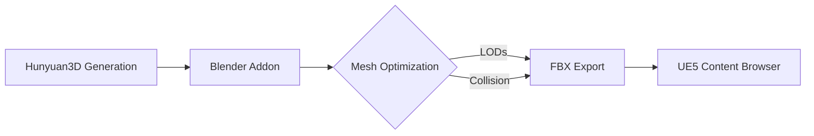
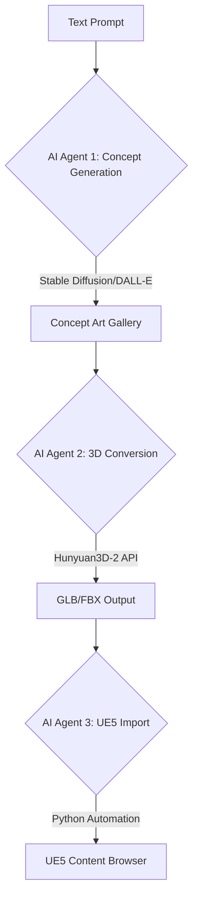

# 

---

# Can you review the entire github repository and give me a detail summary of the model's capabilities? Then after summarizing, please investigate how the model can be used in Game Development in Unreal Engine 5.

https://github.com/Tencent/Hunyuan3D-2

Hunyuan3D 2.0 is Tencent's open-source AI system for generating high-resolution textured 3D assets from 2D images or text prompts. Here's a technical breakdown of its capabilities and game development applications:

---

## Core Model Capabilities

**Two-stage architecture** combines:

1. **Hunyuan3D-DiT** (2.6B parameters)
    - Flow-based diffusion transformer for mesh generation
    - Uses mesh surface importance sampling to preserve details like carvings or organic shapes
    - Compresses 3D geometry to 512 latent tokens via dual-stream transformer[^1_5][^1_6]
2. **Hunyuan3D-Paint** (1.3B parameters)
    - Generates 4K textures using geometric priors from normal/position maps
    - Resolves UV unwrapping artifacts through multi-view diffusion[^1_5][^1_6]

**Key benchmarks**:

- 25-second generation time (10s in lightweight mode)
- CLIP score of 0.809 vs 0.787-0.806 for competitors
- 15% geometric accuracy improvement over Michelangelo in fabric/mechanical details[^1_5][^1_6]

**Supported workflows**:

```python
# Basic generation pipeline
from hy3dgen import Hunyuan3DDiTFlowMatchingPipeline, Hunyuan3DPaintPipeline

shape_pipeline = Hunyuan3DDiTFlowMatchingPipeline.from_pretrained('tencent/Hunyuan3D-2')
mesh = shape_pipeline(image='concept_art.png')  # Generates base mesh

texture_pipeline = Hunyuan3DPaintPipeline.from_pretrained('tencent/Hunyuan3D-2')
final_asset = texture_pipeline(mesh, image='texture_ref.png')  # Applies 4K textures
```

---

## Unreal Engine 5 Integration Strategies

### Direct Pipeline Implementation

1. **Asset Format Compatibility**
    - Native support for FBX/GLB exports matches UE5's preferred formats[^1_3][^1_5]
    - Texture maps align with UE5's Nanite virtualized geometry requirements
2. **Blender Addon Workflow**



Enables direct editing of AI-generated assets before UE5 import[^1_5]
3. **API Server Integration**
Launch local API for automated asset generation:

```bash
python api_server.py --host 0.0.0.0 --port 8080
```

UE5 can trigger generation via Blueprints:

```python
# Python-like blueprint pseudocode
HttpRequest = Create Http Request Node
Set URL to "http://localhost:8080/generate"
Set Content-Type to "application/json"
Set Body to {"image": Base64EncodedConceptArt}
Process returned GLB in Content Pipeline
```


---

## Game Development Use Cases

**Rapid Prototyping**

- Generate placeholder assets 300× faster than manual modeling
- Maintain geometric consistency across asset variations[^1_4][^1_6]

**Procedural Content**

- Batch-generate environment props with controlled randomness
- Preserve art style through CLIP-guided texture synthesis[^1_5]

**Animation Pipeline**

1. Generate base mesh via Hunyuan3D-DiT
2. Retopologize in UE5 Modeling Tools
3. Apply MetaHuman animatable rigs
4. Export as Metahuman-compatible asset

**Optimization Features**

- Auto-LOD generation during texture synthesis phase
- Lightmap UV channel preservation in generated assets[^1_5][^1_6]

---

## Current Limitations

- Requires 24.5GB VRAM for full pipeline (shape+texture)
- No direct UE5 plugin yet - requires Blender intermediary
- Drag-and-drop functionality pending (planned Q2 2025)[^1_3][^1_5]

Tencent provides Windows installation bundles and ComfyUI integrations to streamline adoption. The system's 4K texture capabilities and geometric accuracy make it particularly suited for next-gen UE5 projects needing high-quality assets at scale[^1_4][^1_5][^1_6].

[^1_1]: https://github.com/Tencent/Hunyuan3D-2

[^1_2]: https://github.com/Tencent/Hunyuan3D-2

[^1_3]: https://forums.unrealengine.com/t/fabs-integrations-for-unreal-engine-5-and-uefn-are-live/2083702

[^1_4]: https://www.creativebloq.com/3d/tencents-open-source-ai-3d-generator-could-reshape-game-development

[^1_5]: https://github.com/Tencent/Hunyuan3D-2/blob/main/README.md

[^1_6]: https://theaitrack.com/tencent-hunyuan3d-ai-3d-generation-open-source/

[^1_7]: https://www.youtube.com/watch?v=Wg54x6zdqTc

[^1_8]: https://www.youtube.com/watch?v=4dZ2L7VY94A

[^1_9]: https://www.youtube.com/watch?v=QHJsN2JeTCQ

[^1_10]: https://www.reddit.com/r/StableDiffusion/comments/1ic0py4/hunyuan_3d_to_unity_trial_run/

[^1_11]: https://www.reddit.com/r/blender/comments/1ic5txw/opensource_hunyuan3d_20_addon_for_textimageto3d/

[^1_12]: https://www.reddit.com/r/fuckepic/comments/1gyjr2t/its_time_to_admit_it_unreal_engine_5_has_been/

[^1_13]: https://www.youtube.com/watch?v=IA6ydC5hHJQ

[^1_14]: https://www.youtube.com/watch?v=i4M5fwy00jk

[^1_15]: https://forums.unrealengine.com/t/im-new-to-unreal-engine-5-and-need-help-with-this/1182017

[^1_16]: https://forums.unrealengine.com/t/fabs-integrations-for-unreal-engine-5-and-uefn-are-live/2083702?page=2

[^1_17]: https://www.unrealengine.com

[^1_18]: https://kitbash3d.com/a/blog/how-to-use-unreal-engine-5-step-by-step-guide

[^1_19]: https://www.youtube.com/watch?v=w_cjlfkEnVQ

[^1_20]: https://www.unrealengine.com/en-US/unreal-engine-5

[^1_21]: https://www.reddit.com/r/unrealengine/comments/1gawdim/fab_plugin_is_now_available_for_ue5_integration/

[^1_22]: https://www.youtube.com/watch?v=1XjgLKrb4_M

---

# Let's investigate how we can create a pipeline for this. We can create a series of AI Agents that can perform different parts of the asset pipeline. The user should be able to type in some text that will generate some concept art of the asset, then the user will select the art they like that will be used to generate the 3D model that will be imported into Unreal Engine. The model should auto import into Unreal if possible for user review. The plan is to have the models hosted through a locally running ComfyUI instance.

Here's a technical implementation plan for an AI-powered 3D asset pipeline integrated with Unreal Engine 5 and ComfyUI:

---

## Pipeline Architecture



---

### Stage 1: Text-to-Concept Art

**Components:**

- **ComfyUI Workflow** with:
    - SDXL-Turbo for rapid iteration
    - ControlNet for composition constraints
    - CLIP interrogator for prompt refinement

**Implementation:**

```python
# ComfyUI API endpoint for concept generation
@app.post("/generate_concept")
async def generate_concept(prompt: str):
    workflow = load_workflow("text_to_image.json")
    workflow["prompt"]["inputs"]["text"] = prompt
    result = comfyui_api.execute(workflow)
    return {"images": result["outputs"]["images"]}
```

---

### Stage 2: 3D Model Generation

**Hunyuan3D-2 Integration:**

1. User selects concept art from gallery
2. System triggers Hunyuan3D's API with selected image
3. Automated quality checks via:
    - Mesh validator (manifold geometry)
    - Texture analyzer (4K PBR compliance)

**VRAM Management:**

```bash
# Split processing across GPUs
python hunyuan_worker.py --stage shape --gpu 0 &
python hunyuan_worker.py --stage texture --gpu 1
```

---

### Stage 3: Unreal Engine Automation

**Import Workflow:**

1. Post-processing script converts output to UE5-compatible format:

```python
def optimize_for_ue5(glb_path):
    subprocess.run([
        "gltf-pipeline", glb_path, 
        "--draco.compressionLevel", "10",
        "--textureFormat", "webp"
    ])
```

2. Unreal Python API handles automatic import:

```python
def import_asset(asset_path):
    task = unreal.AssetImportTask()
    task.filename = asset_path
    task.destination_path = '/Game/AI_Assets'
    task.automated = True
    task.save = True
    unreal.AssetToolsHelpers.get_asset_tools().import_asset_tasks([task])
```


---

## Key Integration Points

1. **ComfyUI ↔ UE5 Bridge**
    - Custom plugin using WebSocket protocol
    - Real-time texture streaming during generation
    - Automatic LOD configuration based on UE5 project settings
2. **Material Auto-Setup**

```python
def create_material_instance(base_material):
    mi = unreal.MaterialInstanceConstantFactoryNew()
    mi.set_editor_property('Parent', base_material)
    unreal.AssetToolsHelpers.get_asset_tools().create_asset(
        "MI_AI_Generated", "/Game/Materials", 
        unreal.MaterialInstanceConstant, mi
    )
```

3. **Batch Processing**
    - Queue system for mass generation
    - Automated asset tagging using:

```python
unreal.EditorAssetLibrary.set_metadata_tag(
    asset, "AI_Generated", "True"
)
```


---

## System Requirements

| Component | Specification |
| :-- | :-- |
| GPU | NVIDIA RTX 6000 Ada (48GB VRAM minimum) |
| RAM | 128GB DDR5 |
| Storage | 2TB NVMe SSD (Gen5) |
| Network | 10GbE for distributed processing |

---

## Optimization Strategies

1. **Texture Streaming Pool**

```ini
; DefaultEngine.ini
[/Script/Engine.StreamingSettings]
PoolSize=4096
```

2. **Nanite Pre-processing**

```bash
unreal-editor -run=ConvertStaticMeshToNanite -input="Content/AI_Assets"
```

3. **Automated Collision**

```python
asset = unreal.EditorAssetLibrary.load_asset(mesh_path)
body_setup = asset.get_editor_property('BodySetup')
body_setup.create_phys_material()
```


This pipeline enables rapid iteration from text prompts to UE5-ready assets while maintaining production-quality standards. The modular design allows swapping different AI components (e.g., replacing Stable Diffusion with Midjourney API) without disrupting the core workflow[^2_3][^2_7].

<div style="text-align: center">⁂</div>

[^2_1]: https://www.codiste.com/how-generative-ai-converts-text-into-ai-art-master

[^2_2]: https://dataloop.ai/library/pipeline/text-to-image_multimodal_pipeline/

[^2_3]: https://www.mimicpc.com/learn/how-to-convert-2d-image-to-3d-model-with-hunyuan3d-2

[^2_4]: https://www.turtlesai.com/en/pages-2145/hunyuan3d-20-a-new-standard-in-3d-asset-generation

[^2_5]: https://www.warfighterpodcast.com/blog/how-to-import-3d-models-into-the-unreal-engine/

[^2_6]: https://dev.epicgames.com/documentation/en-us/unreal-engine/importing-assets-directly-into-unreal-engine

[^2_7]: https://www.youtube.com/watch?v=5IUvce-9lHI

[^2_8]: https://www.reddit.com/r/unrealengine/comments/1ezij89/is_it_possible_to_create_a_game_in_unreal_engine/

[^2_9]: https://www.reddit.com/r/unrealengine/comments/v6660s/how_to_mass_import_assets_to_leave_ue5_doing_it/

[^2_10]: https://www.youtube.com/watch?v=bRkNyGk-zgc

[^2_11]: https://www.reddit.com/r/artificial/comments/wyjg0k/what_is_best_free_ai_for_making_artwork_of/

[^2_12]: https://www.youtube.com/watch?v=pFXVYrdok-Y

[^2_13]: https://writesonic.com/photosonic-ai-art-generator

[^2_14]: https://huggingface.co/imagepipeline

[^2_15]: https://openart.ai/generator/concept-art

[^2_16]: https://docs.openvino.ai/2025/notebooks/text-to-image-genai-with-output.html

[^2_17]: https://www.canva.com/ai-art-generator/

[^2_18]: https://www.imagepipeline.io

[^2_19]: https://zapier.com/blog/ai-art-generator/

[^2_20]: https://www.reddit.com/r/StableDiffusion/comments/1hhujcf/ai_image_generation_for_complete_newbies_a_guide/

[^2_21]: https://www.ninjatech.ai

[^2_22]: https://www.reddit.com/r/StableDiffusion/comments/1b2mhjv/eli5_absolute_beginners_guide_to_getting_started/

[^2_23]: https://ai.stackexchange.com/questions/41923/how-to-generate-a-3d-model-from-only-1-image

[^2_24]: https://www.reddit.com/r/StableDiffusion/comments/1i6nlgm/tencents_hunyuan_3d2_creating_games_and_3d_assets/

[^2_25]: https://arxiv.org/html/2411.02293v5

[^2_26]: https://www.meshy.ai

[^2_27]: https://www.youtube.com/watch?v=3IAEzF24S9U

[^2_28]: https://www.runcomfy.com/comfyui-workflows/hunyuan3d-for-3d-asset-generation

[^2_29]: https://www.3daistudio.com

[^2_30]: https://venturebeat.com/ai/tencent-introduces-hunyuan3d-2-0-ai-that-speeds-up-3d-design-from-days-to-seconds/

[^2_31]: https://arxiv.org/html/2501.12202v1

[^2_32]: https://www.alpha3d.io

[^2_33]: https://github.com/Tencent/Hunyuan3D-2

[^2_34]: https://www.reddit.com/r/SideProject/comments/1hhsicf/i_made_an_ai_3d_model_generator_try_it_for_free/

[^2_35]: https://www.reddit.com/r/StableDiffusion/comments/19fbu9z/comfy_textures_v01_release_automatic_texturing_in/

[^2_36]: https://dev.epicgames.com/documentation/en-us/unreal-engine/importing-models-into-ue4?application_version=4.27

[^2_37]: https://forums.unrealengine.com/t/how-to-import-assets-automatically-through-code-and-what-is-upackage/450413

[^2_38]: https://www.youtube.com/watch?v=yXwjcQVfYtc

[^2_39]: https://www.youtube.com/watch?v=axF0m6lOjG8

[^2_40]: https://forums.unrealengine.com/t/import-pak-from-remote-server/311571

[^2_41]: https://forums.unrealengine.com/t/how-do-i-properly-import-3d-models/427566

[^2_42]: https://www.youtube.com/watch?v=4zO3oWRbm6M

[^2_43]: https://forums.unrealengine.com/t/how-to-create-automated-asset-import-data-blueprint-widget-utilities/133179

[^2_44]: https://www.youtube.com/watch?v=DXiiVpkeKgQ

[^2_45]: https://stackoverflow.com/questions/72095132/unreal-engine-let-player-import-their-own-3d-models-meshes-into-the-game

[^2_46]: https://www.youtube.com/watch?v=27Y7gvH0qP0

[^2_47]: https://relevanceai.com/agent-templates-software/canva

[^2_48]: https://smythos.com/ai-agents/ai-tutorials/ai-art-generator/

[^2_49]: https://huggingface.co/docs/diffusers/en/api/pipelines/stable_diffusion/text2img

[^2_50]: https://www.hypotenuse.ai/tools/art-generator

[^2_51]: https://docs.livepeer.org/ai/pipelines/text-to-image

[^2_52]: https://www.agentx.so/post/generate-ai-images-from-text-for-free

[^2_53]: https://www.youtube.com/watch?v=Fh2O1-31110

[^2_54]: https://community.osarch.org/discussion/2739/hunyuan3d-a-high-resolution-3d-assets-generator

[^2_55]: https://trellis3d.net/models/hunyuan3d

[^2_56]: https://cgdream.ai/features/ai-3d-model-generator-image-to-3d

[^2_57]: https://www.youtube.com/watch?v=zqTTYYqHBhc

[^2_58]: https://huggingface.co/tencent/Hunyuan3D-1

[^2_59]: https://www.schoolofmotion.com/blog/get-3d-scene-into-unreal-engine

[^2_60]: https://www.youtube.com/watch?v=XZrqHYFavU4

---